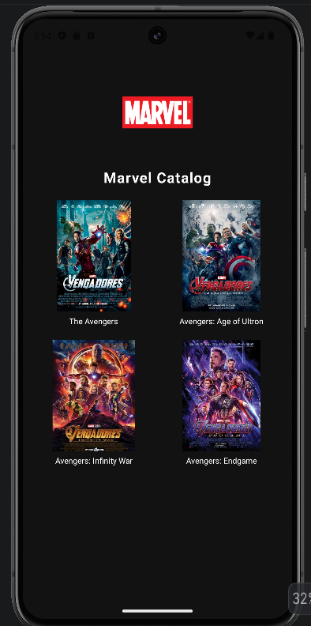
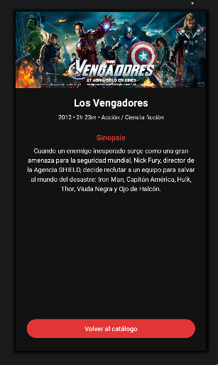

# Marvel Tracker App (PMDM - Práctica 1)

Aplicación nativa para Android desarrollada como proyecto formativo para la asignatura de **Programación Multimedia y Dispositivos Móviles (PMDM)**. La app permite explorar un catálogo visual de producciones cinematográficas de Marvel y acceder a la ficha técnica detallada de cada título.

---

## 📱 Descripción del Proyecto

La aplicación se centra en el diseño de interfaces modernas y adaptables siguiendo las directrices de Material Design y las mejores prácticas de desarrollo en Android:

- **Catálogo Principal (`MainActivity`):** Muestra una cuadrícula equilibrada con los títulos destacados utilizando `ConstraintLayout` y cadenas/guías para organizar las portadas.
- **Vista de Detalle (`DetalleActivity`):** Presenta la información ampliada de la producción ("The Avengers"), incluyendo póster/banner oficial, año de lanzamiento, fase del universo cinematográfico, sinopsis completa y botones de navegación.
- **Soporte Multilenguaje (i18n):** Textos completamente internacionalizados y desacoplados del código fuente en español (`values/strings.xml`) e inglés (`values-en/strings.xml`).
- **Gestión centralizada de recursos:** Paleta de colores corporativa y tipografías reutilizables definidas en archivos de recursos XML.

---

## 📸 Capturas de Pantalla

| Vista Principal (Catálogo) | Vista de Detalle (Avengers) |
| :---: | :---: |
|  |  |

---

## 🛠️ Requisitos Técnicos y Entorno

- **IDE:** Android Studio Ladybug / Iguana o superior.
- **Lenguaje:** Java.
- **Gradle Plugin:** 8.x+
- **Compile SDK:** 34 / 35
- **Min SDK:** 24 (Android 7.0 Nougat o superior)
